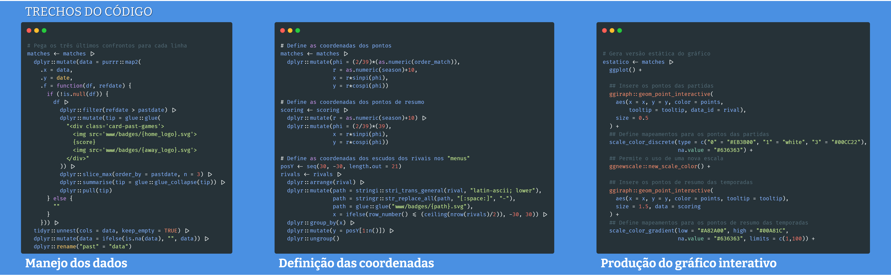
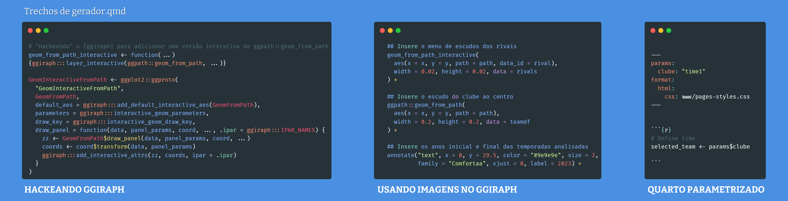
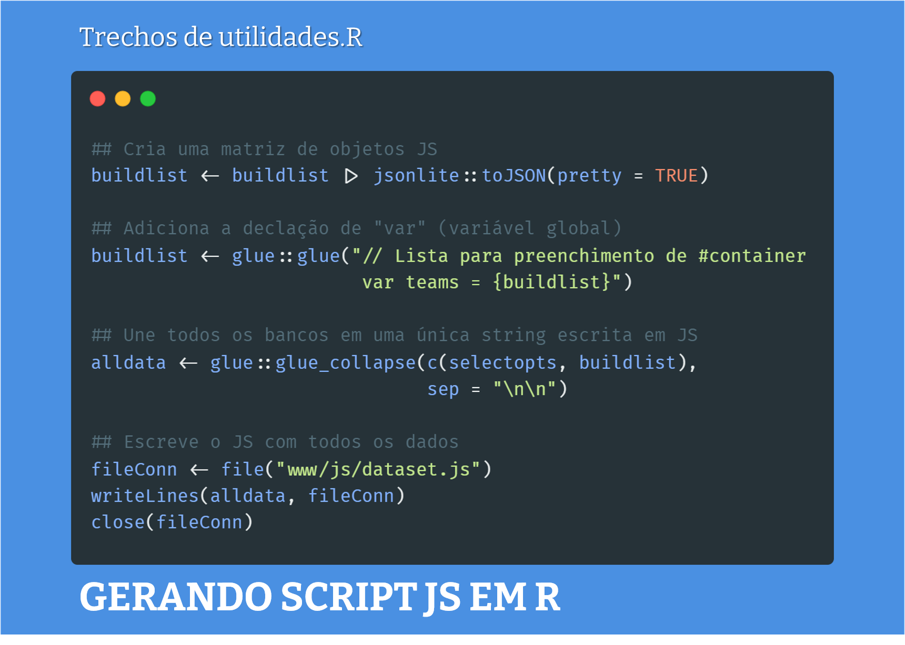
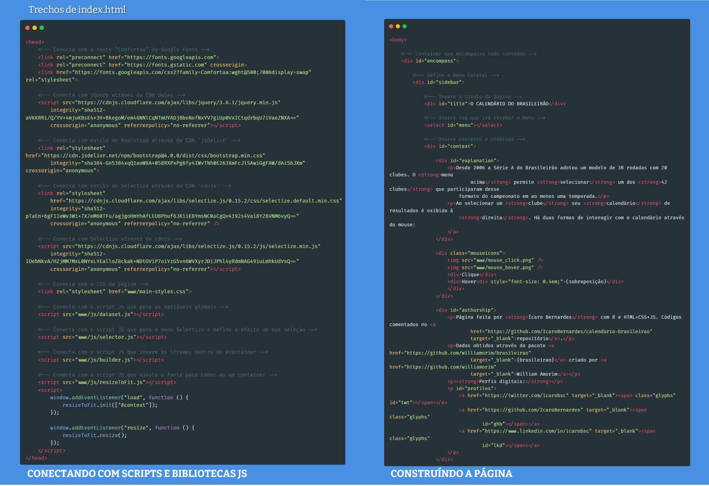

# Calendário circular de partidas do Brasileirão

**Desde 2006 a Série A do Brasileirão adotou um modelo de 38 rodadas com 20 clubes. Essa página exibe informações sobre o desempenho dos 42 clubes que participaram desse formato do campeonato (ao menos uma temporada) através de um calendário circular.** 

## Construção da página

Um dos objetivos desse projeto é acrescentar mais ferramentas de interativade à minha caixa de ferramentas enquanto programador em R. São pilares desse esforço:
- a geração de gráficos interativos em {ggiraph}
- a produção de documentos parametrizados no Quarto
- o uso do R como suporte ao JS
- a produção de páginas com HTML+CSS+JS

### Geração de gráficos interativos em {ggiraph}

📃 Código em [gerador.qmd](https://github.com/IcaroBernardes/calendario-brasileirao/blob/master/gerador.qmd)

Nesse script os dados são processados de sorte a gerar uma visualização na perspectiva de cada um dos clubes. Para tal, os dados foram manejados com abundante uso de {dplyr} e {purrr}. Em seguida, os elementos que compõem a visualização receberam coordenadas no plano cartesiano. Por fim, estes elementos foram agregados para compor o gráfico interativo com {ggiraph}.

É interessante destacar um "hack" que permitiu o uso de imagens também como elementos interativos a partir de uma modificação da função `ggpath::geom_from_path()`. Além disso, a função do script gerador é ser um template para produção parametrizada dos documentos HTML que irão guardar os gráficos interativos. Tarefa essa extremamente simples de concretizar.

### Produção de documentos parametrizados no Quarto

📃 Código em [gatilho.R](https://github.com/IcaroBernardes/calendario-brasileirao/blob/master/gatilho.R)

Nesse script o gerador é ativado para gerar os documentos HTML com os calendários. Isso é realizado com {quarto} e {purrr}. Os parâmetros são passados para o argumento `execute_params` da função `quarto_render()`.

### Uso do R como suporte ao JS

📃 Código em [utilidades.R](https://github.com/IcaroBernardes/calendario-brasileirao/blob/master/utilidades.R)

Nesse script são criadas variáveis que serão consumidas pelos scripts JS. Para tal, uma tibble é convertida a uma string JSON através da função `jsonlite::toJSON()`. Os bancos de dados são declarados no código como `var`, isto é, variáveis com escopo global. Por fim, a string é escrita em um script JS: [dataset.js](https://github.com/IcaroBernardes/calendario-brasileirao/blob/master/www/js/dataset.js)

### Produção de páginas com HTML+CSS+JS

📃 Código em [index.html](https://github.com/IcaroBernardes/calendario-brasileirao/blob/master/index.html)

Nesse script são agregados os scripts JS e construídas as estruturas da página de acesso. Eu fiz uso de algumas bibliotecas JS como `jQuery`, `Bootstrap` e `Selectize` e também construí alguns scripts JS. A estrutura do html é bem simples com um estreito menu lateral e conteúdo ocupando maior parte da página, similar a um Shiny app. Os calendários são carregados através da seleção no menu, o qual indica qual página deve ser carregada com iframe.

## Créditos

Página feita por Ícaro Bernardes com R e HTML+CSS+JS.

**Perfis digitais:**
- Twitter: [@icarobsc](https://twitter.com/icarobsc)
- Github: [@IcaroBernardes](https://github.com/IcaroBernardes)
- Linkedin: [@icarobsc](https://www.linkedin.com/in/icarobsc)

Dados obtidos através do pacote [{brasileirao}](https://github.com/williamorim/brasileirao) criado por [William Amorim](https://github.com/williamorim).
