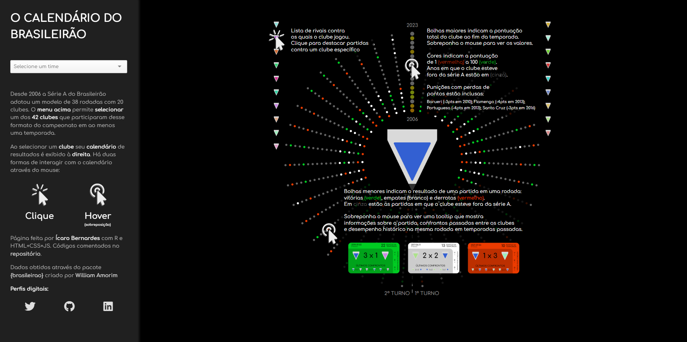
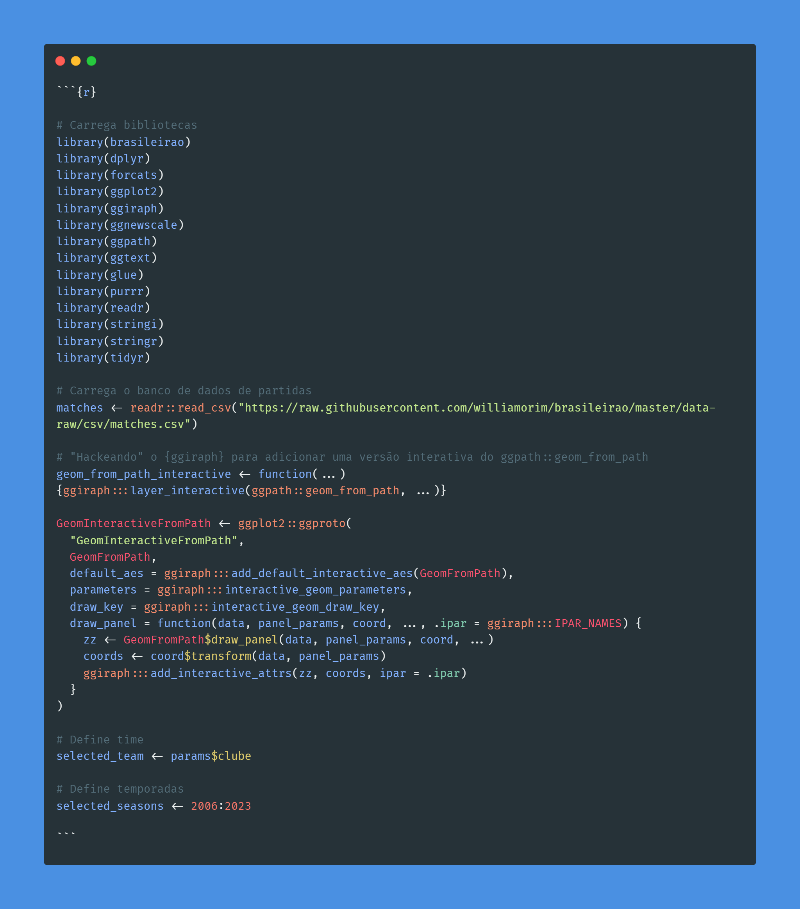

# Calendário circular de partidas do Brasileirão

**Desde 2006 a Série A do Brasileirão adotou um modelo de 38 rodadas com 20 clubes. Essa página exibe informações sobre o desempenho dos 42 clubes que participaram desse formato do campeonato (ao menos uma temporada) através de um calendário circular.** 

## Construção da página

Um dos objetivos desse projeto é acrescentar mais ferramentas de interativade à minha caixa de ferramentas enquanto programador em R. São pilares desse esforço:
- a geração de gráficos interativos em {ggiraph}
- a produção de documentos parametrizados no Quarto
- o uso do R como suporte ao JS
- a produção de páginas com HTML+CSS+JS

### Geração de gráficos interativos em {ggiraph}

## Créditos

Página feita por Ícaro Bernardes com R e HTML+CSS+JS.

**Perfis digitais:**
- Twitter: [@icarobsc](https://twitter.com/icarobsc)
- Github: [@IcaroBernardes](https://github.com/IcaroBernardes)
- Linkedin: [@icarobsc](https://www.linkedin.com/in/icarobsc)

Dados obtidos através do pacote [{brasileirao}](https://github.com/williamorim/brasileirao) criado por [William Amorim](https://github.com/williamorim).
